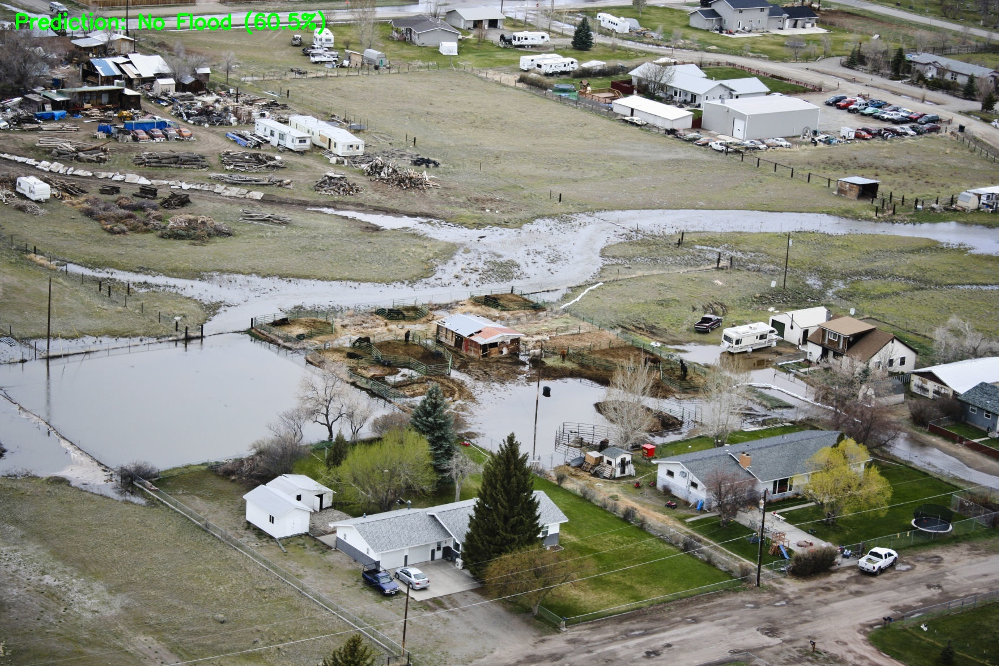
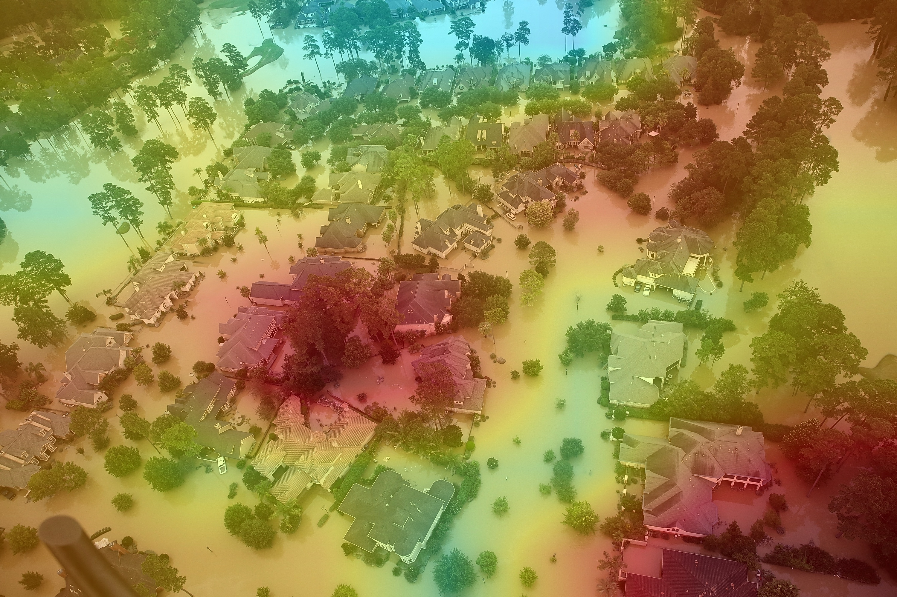
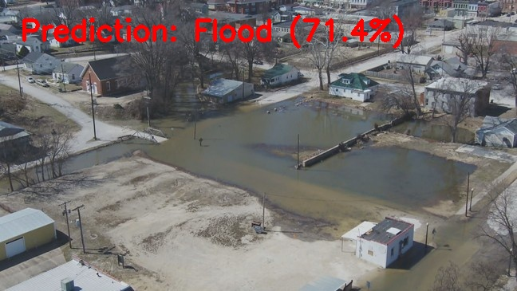
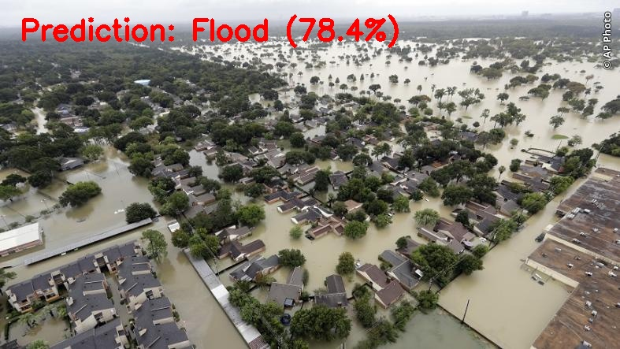
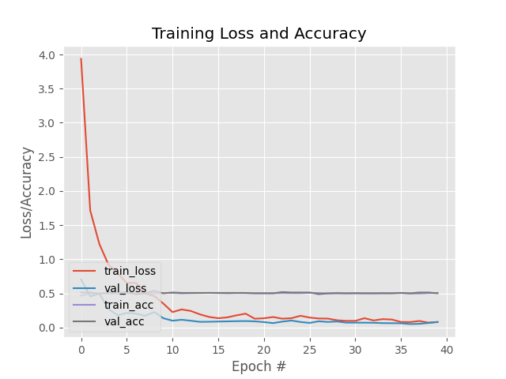
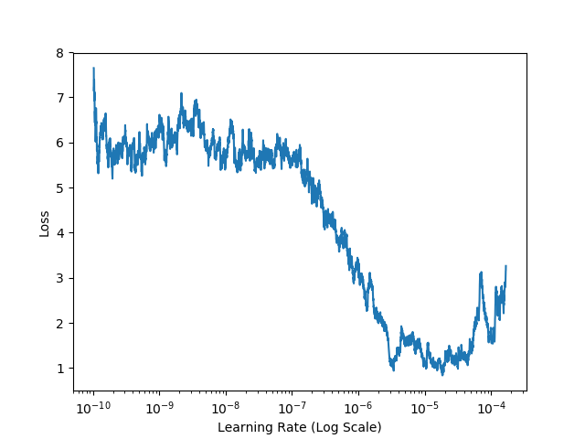
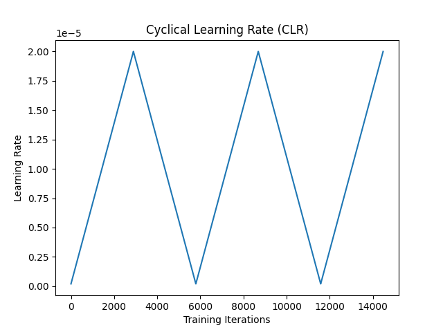
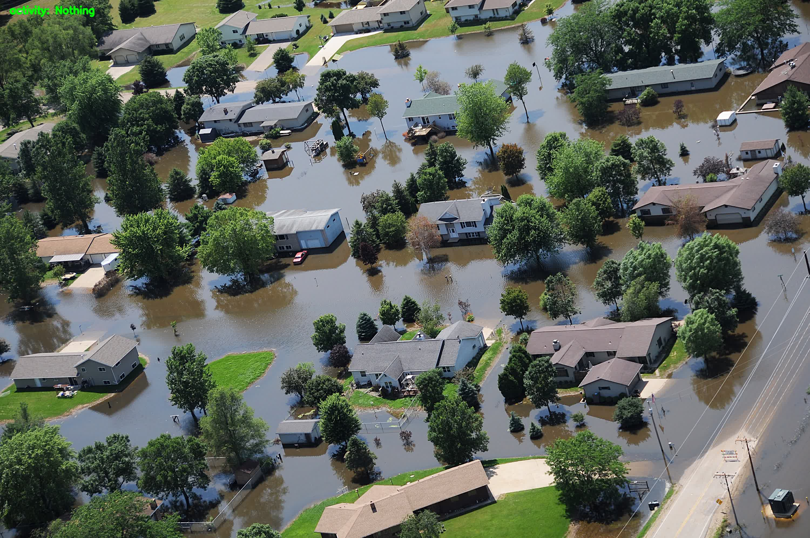

  
# 🌪️ Disaster-Relief-and-Rescue-System (DRAMS) 🚨
> A real-time disaster detection and rescue system made with ❤️ using Python, OpenCV & AI models 🤖  


---

## 🌟 Overview

**DRAMS** is an AI-powered system to **detect disasters** like **fire 🔥 and flood 🌊** in real-time. It helps rescue teams respond faster by sending **automatic alerts 📢 with snapshots 📸**. The project also provides **Grad-CAM visualizations 🧠** for model interpretability.  

---

## 🎥 Demo Video

📺 **Watch the walkthrough here:**  
[](https://youtu.be/4QeUZMUl0Ec)

> 🔗 *Click the image or [watch on YouTube](https://youtu.be/4QeUZMUl0Ec)*
---------

## 🎨 Features

- 🔥 Real-time **fire detection**  
- 🌊 Real-time **flood detection**  
- 🖥️ **Web streaming interface** for live monitoring  
- 📸 Automatic **alert snapshots** on disaster detection  
- 🧠 **Grad-CAM visualizations** for AI predictions  
- 🗄️ Stores data & metadata in **MongoDB**  
- 📱 Fully **responsive** web interface  
- ⚡ Quick AI predictions for emergency response  

---

## 📂 Project Structure

```plaintext
Disaster-Relief-and-Rescue-System/
├── DRAMS/                  # Web app files (Django/Flask)
├── Dataset/                # Fire & flood images/videos
├── firedetector/           # Fire prediction scripts
├── flooddetector/          # Flood prediction scripts
├── alert_snapshots/        # Captured alert images
├── output/                 # Prediction outputs
├── templates/              # HTML templates
├── static/                 # CSS / JS / assets
├── gradcam_visualizer.py   # Grad-CAM visualizer
├── predict_fire.py         # Fire prediction script
├── predict_flood.py        # Flood prediction script
├── train.py                # AI model training script
├── webstreaming.py         # Web streaming interface
├── requirements.txt        # Python dependencies
└── venv/                   # Virtual environment

```
## 🖼️ Screenshots
📸 Real views of DRAMS in action:

## 🖼️ Screenshots
📸 **Real Outputs & Model Visualizations from DRAMS (Disaster Relief and Management System)**

| Fire Detection (Grad-CAM) | Flood Detection Outputs | Flood Detection Variants |
| :------------------------: | :---------------------: | :----------------------: |
|  |  |  |
|  |  |  |

| Model Training Visuals | LR Finder Curve | Color Plot |
| :--------------------: | :--------------: | :---------: |
|  |  |  |

| Raw Output Frame | Grad-CAM (Alt Frame) |
| :---------------: | :-----------------: |
|  |  |


## 🚀 Getting Started
📦 Install Dependencies
```bash
Copy code
git clone https://github.com/Shristirajpoot/Disaster-Relief-and-Rescue-System.git
cd Disaster-Relief-and-Rescue-System
python -m venv venv
source venv/bin/activate  # On Windows: venv\Scripts\activate
pip install -r requirements.txt
```
### ▶️ Run the System
```bash
Copy code
python webstreaming.py
```
🌐 Open http://127.0.0.1:5000 to see live disaster detection

## 🛠️ Built With
- 🐍 Python 3

- 🌐 Django / Flask

- 🖼️ OpenCV for video processing

- 🤖 TensorFlow / PyTorch for AI models

- 🗄️ MongoDB for dataset storage

- 🎨 HTML5 + CSS3 for web interface

## 👩‍💻 Author
### Shristi Rajpoot
- 📧 Email: shristirajpoot369@gmail.com
- 🔗 GitHub: @Shristirajpoot

## 📄 License
This project is licensed under the MIT License.

### 🌟 If you liked this project, consider starring the repo and sharing it!
